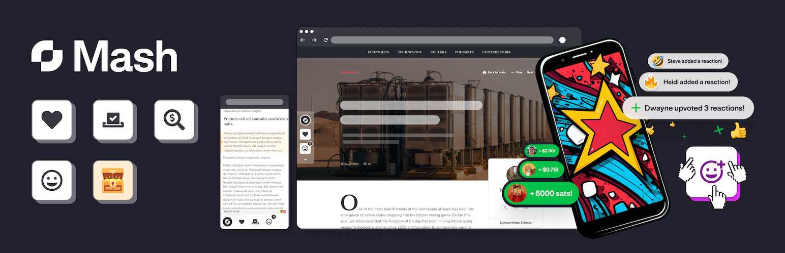

# Mash Wordpress Plugin

This plugin is powered by [Mash](https://getmash.com).

[Mash](https://getmash.com) makes it easy for you to earn more by enabling your users to pay-as-they-enjoy, directly to you, for any amount. In addition to donating to you, your users can pay for any action, usage, event, or experience. Whether revealing written/digital content, voting, watching, listening, filling out a form, or showing their thanks with a “Boost”, Mash allows you to monetize in an entirely new and interactive way! 

## Installation

1. Install plugin through wp-admin/plugin-install.php

OR

1. Upload the plugin folder to your /wp-content/plugins/ folder.
1. Go to the **Plugins** page and activate the plugin.

Once the plugin is installed, make sure you have a Mash Earner account. This account can be created [here](https://wallet.getmash.com/earn).

## Features

- Add the Mash Wallet to your site without writing any code
- Control which pages and posts show the Mash Wallet
- Add Mash-powered components with shortcodes and Gutenberg Blocks:
  - Mash Boost Button
  - Mash Paywall

## Having issues with the plugin?

If you are having issues setting up and configuring the plugin, or run into any bugs, please feel free to reach out. 
You can either create a issue in this repository, or reach out directly on Telegram: [Mash Partner Support](https://t.me/mashpartners).
